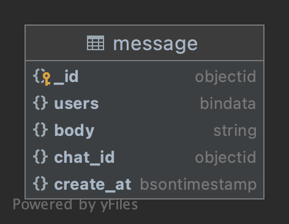

#Sharding

---

## About

- Для хранения данных сервиса обмена сообщениями мною была выбрана MongoDB
- Основная БД приложения изначально выбрана MySQL, в ней было три варианта реализовать горизонтальное масштабирование с помощью шардирования: на уровне приложения(на мой взгляд более правильный и дорогостоящий вариант), с помощью ProxySQL(дешевле, но не совсем надежное решение, скорее всего будет нужна поддержка на уровне приложения), Vitess(довольно сложная настройка и порог вхождения)
- В MongoDB шардирование и репликация поддерживаются из коробки, а так же желание попробывать новую технологию стало причиной выбора данной БД

## Data Model

 

Сообщения связаны с чатами связью один-к-одному.
Возможны групповые чаты с неограниченным числом пользователей

Чат содержит в себе название, список пользователей чата. Предположительно чатов будет не слишком большое количество, и их шардирование на данный момент не целесообразно

Сообщения содержат в себе id-пользователя, написавшего это сообщение,
id-чата, к которому оно относится, timestamp времени создания и сам текст сообщения.
Сообщения шардируются **по чату, к которому они относятся** (chatId) и **по времени написания** (timestamp),
чтобы учесть “Эффект Леди Гаги”.
Исходил из следующих соображений:
1. Люди обычно просматривают все сообщения одного чата, при этом сначала более новые сообщения, потом более
   старые. Соответственно стоит хранить данные, относящиеся к одному чату и близкие по времени на одном шарде.
2. Человек (пользователь или пользователи в групповой чат) одновременно может писать много сообщений.
   Обычно неравномерно распределено количество сообщений между разными чатами и реже бывает пользователь, который
   пишет много сообщений в разные чаты одновременно. Поэтому стоит группировать сообщения по идентификатору чата
   и времени написания сообщения.
3. Так как в чат пишут обычно как минимум два человека, то хранить рядом сообщения одного конкретного пользователя (по fromId)
   не логично, так как запросов на сообщения одного конкретного пользователя не будет.

Так как **timestamp** - монотонная последовательность,
то ему лучше подходит hashed ключ шардирования. Сообщения, написанные одним пользователем, будут лежать рядом,
но в зависимости от timestamp-а на разных шардах.

**Id-чата** монотонная последовательность, поэтому тоже используем hashed ключ шардирования для равномерного
распределения по шардам.

## Install MongoDB shard cluster && trade-chat-app
- Кластер MongoDB можно развернуть в докере следуя инструкции
https://github.com/chefsplate/mongo-shard-docker-compose

- Создать базу данных **trade**.
```sql
use trade
```
- Включить шардинг для базы данных **trade**.
```js
sh.enableSharding("trade")
```
- Создать индекс по полям, входящим в ключ шардирования (chat_id и created_at).
  Сортируем по id-чата в ASC порядке, для timestamp-а в DESC порядке.
```js
db.message.createIndex({"chat_id": 1, "created_at": -1})
```
- Включить шардинг для коллекции **message**.
```js
sh.shardCollection("trade.message", {"chat_id": 1, "created_at": -1})
```
- Запустить экземпляр (экземпляры) сервиса диалогов trade-chat-app
- Коллекция запросов для тестирования сервиса (https://github.com/orensimple/trade-chat-app/blob/main/trade-message.postman_collection.json)

## Resharding

Процедура решардинга происходит с помощью внутреннего процесса mongodb, который называется balancer
(https://docs.mongodb.com/manual/core/sharding-balancer-administration/#sharding-balancing).

Добавление шардов в кластер описано здесь:
https://docs.mongodb.com/manual/tutorial/add-shards-to-shard-cluster/

Процесс удаления шардов из кластера описан в документации здесь:
https://docs.mongodb.com/manual/tutorial/remove-shards-from-cluster/
---